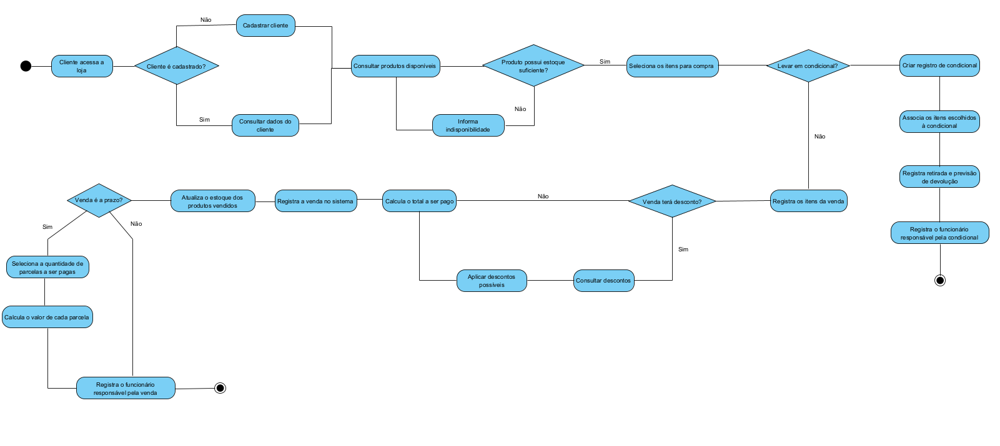
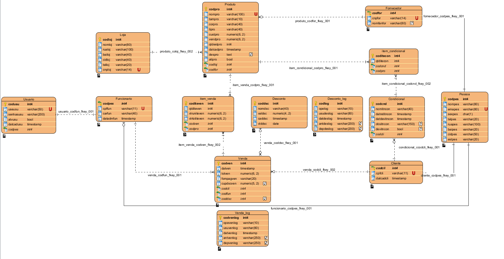

<h1 align="center">👚 Monamu 🛍️</h1>
<h4 align="center"><em>Sistema de Gerenciamento de Loja de Roupas</em></h4>

---

## 📝 Objetivo

O Monamu é um sistema para gerenciar uma loja de roupas, permitindo o controle de produtos, vendas, clientes, funcionários e fornecedores.
Foi desenvolvido como trabalho acadêmico para a disciplina de Engenharia de Software I, Banco de Dados II e Programação II do curso de Ciência da Computação da UNOESC.

## ✅ Funcionalidades do Sistema

| Área | Funcionalidade | Descrição |
|------|----------------|-----------|
| **📊 Dashboard** | Totais e alertas | Exibe totais de clientes, produtos em estoque e alertas de condicionais vencendo no dia. |
| **🔄 Produtos** | Cadastro | Cadastro detalhado com nome, tamanho, cor, tipo, preço de custo, preço de venda, quantidade em estoque, fornecedor e descrição. |
| **👥 Clientes** | Cadastro | Registro de clientes com código, nome, CPF, telefone, e-mail, endereço e data de cadastro. |
| **🧑‍💼 Funcionários** | Cadastro | Registro de funcionários com código, nome, CPF, cargo, data de admissão, telefone, e-mail e endereço. |
| | Login | Sistema de cadastro de usuário e senha para acesso ao sistema. |
| **📦 Fornecedores** | Cadastro | Registro de fornecedores com código, CNPJ, nome da empresa, e-mail, telefone e endereço. |
| **🛒 Vendas** | Registro de venda | Registro de vendas com data, cliente, funcionário, produtos vendidos (quantidade e preço), total e forma de pagamento. |
| | Cupons e Descontos | Registro e controle de cupons vinculados a campanhas ou promoções. |
| | Controle de estoque | Baixa automática do estoque após a finalização da venda. |
| **🔁 Condicional** | Registro | Registro de vendas no formato condicional, com data de retirada e data prevista para devolução. |
| | Controle | Marcação de condicional devolvida ou não. |
| **🏬 Loja** | Cadastro | Registro da loja com código, nome, rua, bairro, cidade, CNPJ e telefone de contato. |

## 📄 Requisitos do Sistema

O Monamu foi desenvolvido seguindo requisitos funcionais e não funcionais que orientam o cadastro de produtos, clientes, funcionários, fornecedores, controle de vendas, condicional, estoque e loja.

Para ver todos os requisitos detalhados, acesse o [documento dos requisitos](Monamu-Requisitos.pdf).

## 📁 Estrutura de Pastas e Arquivos

- **📂 [Diagramas](./Diagramas)**
  - 📄 [Diagrama de Estado.vpp](./Diagramas/Diagrama%20de%20Estado.vpp)
  - 📄 [Diagrama de Classes.vpp](./Diagramas/Diagrama%20de%20Classes.vpp)
  - 📄 [Diagrama de Sequência.vpp](./Diagramas/Diagrama%20de%20Sequência.vpp)
  - 📄 [Diagrama de Atividades.vpp](./Diagramas/Diagrama%20de%20atividades.vpp)
  - 📄 [Monamu.vpp](./Diagramas/Monamu.vpp)
  - **📂 [Modelos de Caso de Uso](./Diagramas/Modelos%20de%20Caso%20de%20Uso)**
    - 📄 [Cadastro de funcionários.vpp](./Diagramas/Modelos%20de%20Caso%20de%20Uso/Cadastro%20de%20funcionários.vpp)
    - 📄 [Cadastro de produto.vpp](./Diagramas/Modelos%20de%20Caso%20de%20Uso/Cadastro%20de%20produto.vpp)
    - 📄 [Fluxo de caso de uso.pdf](./Diagramas/Modelos%20de%20Caso%20de%20Uso/Fluxo%20de%20caso%20de%20uso.pdf)
    - 📄 [Vendas.vpp](./Diagramas/Modelos%20de%20Caso%20de%20Uso/Vendas.vpp)

- **📂 [Scripts](./Scripts)**
  - 📄 [Backup e Restore - Monamu.pdf](./Scripts/Backup%20e%20Restore%20-%20Monamu.pdf)
  - 📄 [Script de Criação - Monamu.sql](./Scripts/Script%20de%20Criação%20-%20Monamu.sql)
  - 📄 [Script de Inserts - Monamu.sql](./Scripts/Script%20de%20Inserts%20-%20Monamu.sql)
  - 📄 [Script de Política de Acesso - Monamu.sql](./Scripts/Script%20de%20Política%20de%20Acesso%20-%20Monamu.sql)
  - 📄 [Script de Procedures - Monamu.sql](./Scripts/Script%20de%20Procedures%20-%20Monamu.sql)
  - 📄 [Script de Triggers - Monamu.sql](./Scripts/Script%20de%20Triggers%20-%20Monamu.sql)
  - 📄 [Script de Views - Monamu.sql](./Scripts/Script%20de%20Views%20-%20Monamu.sql)

- **📂 [Monamu](./Monamu)**
  - *(código-fonte Java + frontend HTML/CSS/JS do sistema)*

- 📄 [Monamu-requisitos.pdf](./Monamu-requisitos.pdf)

## 🛠️ Tecnologias Utilizadas

### **Backend**
- ☕ **Java**
- 🌱 **Spring Boot**
- 🗂️ **JPA / Hibernate**
- 📦 **Maven**

### **Banco de Dados**
- 🐘 **PostgreSQL**
- 🛠️ **DBeaver**
- 🖥️ **pgAdmin**

### **Frontend**
- 🌐 **HTML5**
- 🎨 **CSS3**
- ⚙️ **JavaScript**
- 🎀 **Bootstrap 5**

### **Modelagem e Documentação**
- 📊 **Visual Paradigm**
  
### **Ferramentas de Desenvolvimento**
- 🖥️ **Eclipse**
- 📝 **VS Code**
- 🔧 Git
- 🌐 GitHub

## 📊 Diagramas do Sistema

Abaixo estão algumas representações gráficas feitas para entender a estrutura e o funcionamento do Monamu.  

## Diagrama de Atividades

## Modelo Relacional

## 🚀 Como Executar o Projeto

Siga os passos abaixo para rodar o Monamu localmente:

1. Clone o repositório:  
   `git clone https://github.com/SEU_USUARIO/monamu.git`

2. Acesse a pasta do projeto:  
   `cd monamu`

3. Configure o banco de dados PostgreSQL no arquivo `src/main/resources/application.properties`:

4. Crie o banco de dados (se ainda não existir):
`CREATE DATABASE monamudb;`

5. Execute o projeto usando Maven:  
`./mvnw spring-boot:run`  

6. Acesse o sistema no navegador:  
`http://localhost:8000`

Pronto! Agora você pode explorar todas as funcionalidades do Monamu.

## 👨‍💻 Desenvolvedores

<table>
  <tr>
    <td align="center">
      <a href="https://github.com/maiarakothe" style="text-decoration: none; color: inherit;">
         
        <strong>Maiara Braun Kothe</strong>
      </a>
    </td>
    <td align="center">
      <a href="https://github.com/MatheusBamberg" style="text-decoration: none; color: inherit;">
         
        <strong>Matheus Scherer Bamberg</strong>
      </a>
    </td>
    <td align="center">
      <a href="https://github.com/Zilles09" style="text-decoration: none; color: inherit;">
         
        <strong>Moisés Augusto Braun Zilles</strong>
      </a>
    </td>
    <td align="center">
      <a href="https://github.com/eric-camini482" style="text-decoration: none; color: inherit;">
         
        <strong>Eric Camini</strong>
      </a>
    </td>
  </tr>
</table>
